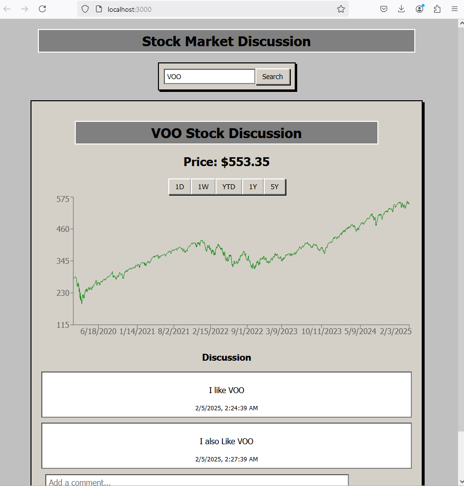

# Stock Discussion App

A full-stack web application built with Flask (backend) and React (frontend) that allows users to view stock data and post discussions about specific stocks. This project uses a SQLite database to store posts related to stock tickers.

## Features
- **View Stock Data**: Fetch the current stock price for a specific ticker (currently a dummy price is used).
- **Post Discussions**: Users can post comments or discussions related to a particular stock ticker.
- **Database**: A SQLite database is used to store posts for each stock ticker.

## Tech Stack
- **Backend**: Flask (Python)
- **Frontend**: React (JavaScript)
- **Database**: SQLite
- **Cross-Origin Resource Sharing**: Flask-CORS for enabling cross-origin requests between the frontend and backend.

#Requirements
    Python 3.x
    Flask
    Flask-CORS
    SQLite
    React

# SETUP
    1) cd frontend
    2) python -m venv .venv
    3) .venv\scripts\activate
    4) pip install requirements.txt
    5) npm install     
    6) npm start
    7) CD backend            
    8) python createdb.py     #create the database
    9) python app.py

# Usage

    Navigate to http://localhost:3000 in your web browser.
    You can enter a stock ticker symbol (e.g., "AAPL" for Apple) and view the stock price (dummy value for now).
    You can also post discussions related to that stock ticker.

    JB

    

